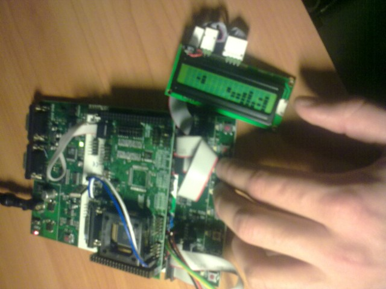

```
NOTE: this is a random one-night one-iteration school project from around 2006 or 2008, preserved here for history and laughs
```

Zemmin tetris STK128:lle
==

Yhdessä yössä väsätty, paljohan voisi parantaa, mutta Pieka tykkäsi!

Ainakin näppäinten lukua pitäisi kehittää. Tässä versiossa näppäinpainallus käynnistää downcounterin jonka toiminta-aikana näppäinpainallukset hylätään, joka oli ensimmäinen mieleen tullut nopea tapa toteuttaa näppäinten luku testiversiossa. Tämähän johtaa siihen, että esim kahden eri komennon (lähes) yhtäaikainen antaminen ei onnistu. Flood-esto pitäisi toteuttaa näppäinkohtaisesti.


